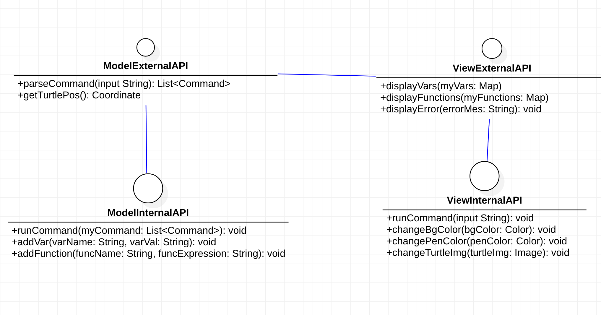
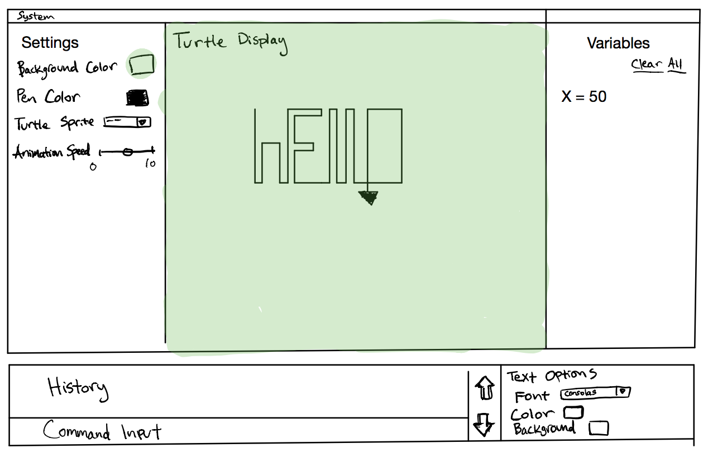
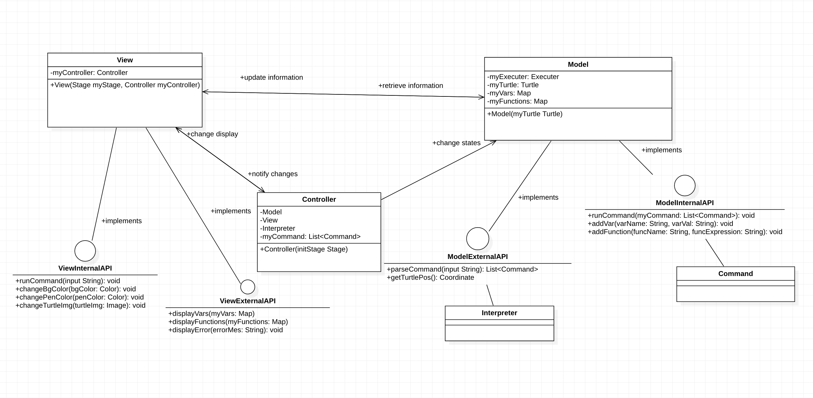

DESIGN_PLAN.md
===

### Introduction

* Problem
    * Create a development environment for learning programming through SLogo language
* Primary Design Goal
    * Creating a flexible, modular, and well-designed SLogo program. We want to make our own lives easier when we try to add additional feature in the upcoming week.
* Primary architecture of the design
    * View
        * The view is what the user will see and will contain all the components which the user will interact with. It will take uesr input and pass it to a controller, and will receive updates from the back end as to how to update itself.
        * View class has the following components: frontend.CommandView, frontend.HistoryView, frontend.FunctionView, and frontend.DisplayView
    * frontend.Controller
        * The controller is the communicator between the View class and the backend.Model class. Whenever an external API needs to be called from View or backend.Model class, the controller will pass the command to the other side.
        * When the program starts, the controller instance will be initialized. It will contain a view instance and a model instance.
    * backend.Model
        * The model contains the backend.Model class, backend.Turtle class, the Interpreter class, and the Command class. The backend.Model class is responsible for holding the backend.Turtle instance and the Interpreter instance. Once a user input string comes in from the frontend.Controller, the backend.Model class uses the interpreter to parse the input and calls appropriate method on the turtle. After the coordinate of backend.Turtle instance has been changed, the View calls backend external API to get backend.Turtle instance's postion and display it on the View.
        * The interpreter is responsible for parsing the string input and call the appropriate function on the turtle. If the string from a command is a variable or a function, the backend.Model calls the internal API to add the variable or the function to the backend.
        * The turtle encapsulates the possible movements and functions that the turtle can do on the GUI panel. It contains the internal API that the interpreter can call once the interpreter parses the user command. It also contains the coordinate (including the x and y coordinate and the angle).

### Design Overview

* Front-End Internal API:
    * This API allows the user interface to manage its appearance, through manipulating elements such as text displays and other variable display elements such as the turtle sprite and the color of the pen. Additionally, this API will pass information to the View class such as the text from the textbox input.
    * We plan to make our API extendable by using interfaces. For example, we plan to create a 'frontend.SubView' interface that allows us to have other classes implement it. For example, we would want a frontend.CommandView class and frontend.VariableView class that implement the frontend.SubView interface. That way, if anyone ever needs to create a new type of View, there will already be a set of methods that that new class needs to implement.

* Front-End External API:
    * This API will be used to control the user display by other classes in the program. It will update values in the User interface such as the displayed values of the custom-defined variables/functions or being told to display an error message. The backend will manage the UI through this API.
    * We decided to try and limit the scope of this API, as we feel as though we don't necessarily want the Front-end classes to be called too much by the back-end. The main front-end class, View, will exist only in the frontend.Controller class and main class, and the only methods it can call on View, for now, are updating the variable names to be displayed, and signaling the View to display an error.

* Back-End Internal API:
    * This API dictates the contract between the interpreter/model controller class and the turtle class. Once the interpreter parses the user command, the command will be represented in a list. These commands will be called sequentially and they can call on the internal turtle API and give specific instructions to the turtle. It is likely that we will add more methods to this internal API as we add additional features to the program.
    * We plan to enhance flexibility by using a 'Moveable' interface, and a 'Command' interface. The former interface lists the rules of how a 'moveable' object, such as a turtle, must follow. The latter interface lists some of the commands that the SLOGO language accepts. For example, the logo language accepts commands such as "fd" and "FD", but not fwrd". If we ever needed to change that, we implement another command class based on the Command interface. 

* Back-End External API:
    * This API will be used by the front-end to pass user input to the back-end. This will include such functionality as parsing a command as well as a getter for the backend.Turtle's coordinate (including its x and y coordinate and its angle).
    * Like the Front-end External API, we wanted the scope of this to be small so that there is minimal dependence between the front end and back-end. For example, one of the methods in this API is "frontend.Controller.passCommand()". This allows us to pass the responsibility of validating, parsing, and executing the command to the back end of the project. Therefore, no logic regarding the commands are done within the front-end.

### User Interface

* The main screen for the program will consist of the primary window, divided into sub-components for each of the Panes we are creating, including one for the turtle display, one for the history display, and one for the text input. The user can enter text in the text input pane to generate graphics on the turtle display, and the previously entered commands will be displayed in the history Pane. Additionally, there will be a turtle speed slider that affects the animation speed of the turtle as it carries out its commands. If the user's text input is invalid, they will receive a message detailing the error and potential reasons in the history display, which will double as a pseudo-console, and the command will not run.

### API Details

_Also see the project 'doc' folder for the interfaces and explanation of each inside the code._

* External: between the two sub-groups

    * ```ViewExternalAPI```: communicates with back-end external through the frontend.Controller
        * displayVars(Map<String, String>) will be called by the frontend.Controller when a new variable is added to the backend.Model. It will update the view of the frontend.VariableView.
        * displayFunctions(Map<String, String>) will be called by the frontend.Controller when a new functionf is added to the backend.Model. It will update the view of the frontend.FunctionView.
        * displayError(String) will be called when the interpreter detects an error, such as entering an undefined command or multiple commands.

    * ```ModelExternalAPI```: contains Back-End External API methods that Front-End calls after it receives user command input
        * parseCommand(String) is called by the frontend.Controller when a command is passed from the View. It lets the interpreter to parse the command. If it detects the command is defining a variable or a function, then it will send this information to the internal API by calling addVar(String, String) or addFunc(String, String).
        * getTurtlePos() is called by the frontend.Controller in order to pass the position information back to the View to be displayed.

* Internal: between each sub-group and its future programmers (maintainers)
    * ```ViewInternalAPI```:
        * ```View``` is an aggregate of all the subcomponents in UI
            * runCommand(String) is called from the frontend.CommandView whenever a command is submitted. It then passes the string to the frontend.Controller.
            * changeBgColor(Color) changes the background color when the user changes the background color choice in the UI.
            * changePenColor(Color) changes the pen color when the user changes the pen color choice in UI.
            * changeTurtleImg(Image) changes the turtle's image when the user upload a picture to be the turtle.
            * ```frontend.SubView``` Interface contains method getView(), which returns a Node
                * ```frontend.CommandView``` implements ```frontend.SubView```
                    * Textbox with a event handler. When "enter" key is pressed, it can get the string, pass the string into the View by calling runCommand(String), and clears the text.
                * ```frontend.HistoryView``` implements ```frontend.SubView```
                    * A ScrollPanel that contains all the history command
                * ```frontend.DisplayView``` implements ```frontend.SubView```
                    * A Panel displaying the image of the turtle
                * ```frontend.VariableView``` implements ```frontend.SubView```
                    * A ScrollPanel displaying all the variables that the user defines
                * ```frontend.FunctionView``` implements ```frontend.SubView```
                    * A ScrollPanel displaying all the functions that the user defines
            * By having subView be an interface, we can have all of our different panels implement it, and in the future if we want other panels in our design, we will be easily able to implement them.
    * ```ModelInternalAPI```: backend.Turtle contains the internal API that the Interpreter class calls after parsing user input. The turtle will be responsible for calling the front-end external API to move on the grid. It includes the following methods:
        - runCommand(List<> myCommand) is called within the model after the parser has parsed the command and returned a list of Command. It returns void because the Commands perform actions directly on the coordinate of the turtle.
        - addVar(String, String) is called within the model after the parser has identified a new variable is defined (most likely through the syntax "make"). It adds the variable to the list of the variables in the model.
        - addFunc(String, String) is called within the model after the parser has identified a new function is defined. It adds the function to the list of the functions in the model.
        -
        - ```Interpreter``` class
            - parseCommand(String input)
        - ```backend.Turtle (backend.Model)``` class
    		- Forward(double amount)
    		- Backward(double amount)
    		- returnHome()
    		- implements moveable interface
    	- ```Command``` class
    	    - Forward()
    	    - Backward()
    	    - ChangeAngle()
    	    - all other possible commands that are valid in the Logo language
    	* We plan to have the backend.Turtle implement an interface called ```Moveable```. This allows us to allow our program to be flexible in case we want to later implement different types of models, such as models that behave differently than our turtle.

### API Example Code
_It is especially important in helping others understand how to use your APIs to provide example code. It should be clear from this code which objects are responsible for completing each part of the task, but you do not have to implement the called functions._

Show an actual "sequence of code" that implements the following use case using only methods described in your APIs:
The user types 'fd 50' in the command window, and sees the turtle move in the display window leaving a trail, and the command is added to the environment's history.
Note, clearly show the flow of calls to public methods needed to complete this example, indicating which class contains each method called. It is not necessary to understand exactly how parsing works in order to complete this example, just what the result of parsing the command will be.
Additionally, each member of the team should create two use cases of their own (and example code) for the part of the project for which they intend to take responsibility. These can still be done as a group, but should represent a variety of areas of the overall project.

* When the user inputs the command 'fd 50', our frontend.CommandView class calls the runCommond(String) in the ViewInternalAPI. Inside this method, parseCommand(String) method in the ModelExternalAPI will be called, inside which the Interpreter class will call Interpreter.parse('fd 50').
* While parsing, if the command is not valid, the frontend.Controller sends an exception back to the View via the public method displayError(String).
* If it is valid, the Interpreter continues to check if the command is an action of defining a variable or function. If so, it will call addVar(String, String) or addFunction(String, String) to add the variable or the function into their corresponding map.
* If the command is valid and not defining a variable of function returns an arrayList of parsed strings, so for example the arrayList would be of size 2 and contain the items "Forward" and "50". Then, we do reflection on the arrayList, and call the appropriate commands of the Command class. So within the frontend.Controller we would call Command.Forward(50), and inside the Command class the method Forward would call backend.Model.Forward(50). The turtle then moves forward 50 units, and since the turtle is within the root of the application, the change is displayed immediately. We will now list the methods called

* frontend.CommandView: View.runCommand("fd 50"), which calls frontend.Controller.runCommand("fd 50")
* frontend.Controller: Interpreter.parse('fd 50'), inside which we call Interpreter.validate("fd 50"), an internal method to check whether the command is valid or not.
* frontend.Controller: Command.Forward(ArrayList<("Forward", "50")>)
* Command: backend.Model.Forward("50")
* backend.Model: Logic to move the turtle forward whichever way it is facing

```java
Class.forName("Command").getDeclaredMethod("fd").invoke(Command object, 50);
```
Use Cases (2 per person):
* **Jose**
    * Working on the backend, and primarily focusing on the way the input commands are parsed and then fed to the Command class to execute on the model (or turtle).
    * *Use case 1*: Parsing the "fd50" command (invalid command)
        * The Front-end Doesn't worry about validating a command to see if it is valid or not, that is why the Controllerclass has a public method passCommand() that allows the View to pass the responsibility over.
        * Once the command string is in the frontend.Controller, the first thing that happens is the frontend.Controller calls the parse method of the Interpreter class. This method validates that the command is indeed a valid one, and if not an IllegalCommandException is thrown. Since this command is not valid by the rules of Logo (no space between fd and 50), an  illegalCommandException is thrown, and an error message is displayed to the user.
    * *Use case 2*: Parsing the "backwards 50 FD 20" command
        * This process would be the same as the first step of the previous use case.
        * Once the command is in the frontend.Controller, the Interpreter class validates it (as it is a valid command), and then parses the command, which turns the commands into a single form that we can work with. For example, the strings "fd" and "FD" would both become "Forward". Therefore, the output of the 'parse' method is an arraylist with the contents ("Backwards", "50", "Forward", "20").
        * Using reflection, the commands are then run via calling the respective command son the Command class, which would be Command.Backwards(50) and Command.Forward(50).
* **Vincent**
    * *Use case 1*: reporting error for invalid command
        * When an undefined command is detected inside the ModelExternalAPI's parseCommand method, it will call the method displayError(String) from the ViewExternalAPI(String) with the string being "Undefined command! Please review the Help tab for the correct ones".
        * Inside View class, it will then create a new Alert with the Error type. The string will be used as the content of the alert and will be shown in the window.
    * *Use case 2*: display variables after the map of variables is updated
        * After the interpreter identifies a variable, it calls the addVar(String, String) method in the ModelInternalAPI, which appends the new variable into the myVars (a HashMap) within the backend.Model and let frontend.Controller call the displayVar(myVars).
        * Inside View class, it calls frontend.VariableView, passing it with the updated myVars and let it display on the frontend.VariableView.
* **Harry**
    * *Use case 1*: receive forward 50 command and move the turtle 50 unit distance forward
        * When the interpreter returns a list of cleaned, validated String, the controller class uses a hash map to find the appropriate command object and call its run() method.
        * The command subclass corresponding to the forward command will then take in the parameter 50 and call the turtle.move() command.
        * backend.Turtle will change its position accordingly and the front end will automatically update the position of the turtle.
    * *Use case 2*: receive penup command and turn off the pen
        * The interpreter returns cleaned, validated string and the controller finds the appropriate penup command subclass.
        * The penup command subclass call the turtle internal API penup() method
        * The turtle disables its instance variable tracer. The tracer stops showing up on the GUI. Command complete.
* **Ben**
    * *Use case 1*: The user wants to change the pen color to Red
    * *Use case 2*: A new custom variable is defined, X = 50

### Design Considerations

* We are still debating as to which component should have reference access to the other components. What instance variables or references should each class have?
* Should the interpreter have an instance of the turtle and calls the turtle's function directly? Or should it return some "command" object back to the model control class and let the model control class or turtle class handle the instructions?
* Should we use reflection to handle the myriad of command cases that will inevitably keep expanding? It is often said that reflection is a crutch for bad design, so we would like to avoid it, but the alternatives seem even worse (curtains of if-else statements) or difficult to implement (hashmap mapping string to different command objects implementing a Commandable interface).
* Another thing we discussed is how we want to handle the way the turtle is actually moved. Should we include the turtle in the root of the scene, should we have the turtle be an observable object and register observers to it, or should we manually update the screen by calling turtle.getpos()?
    * Right now, we have decided to use the observable way. This way, the View and frontend.Controller are both observers of the turtle, and when it changes, those two classes are notified.

### Team Responsibilities

* Frontend Classes
    * Primary:
        * Ben Xu: UI design and display
        * Vincent Liu: Event handling
    * Frontend Internal API
        * Primary: Ben Xu
        * Secondary: Vincent Liu
    * Frontend External API
        * Primary: Vincent Liu
        * Secondary: Ben Xu
* Backend Classes
    * Primary:
        * Harry Xie: backend.Turtle class, Command class
        * Jose: Intepreter Class, frontend.Controller Class
    * Backend Internal API
        * Primary: Harry Xie
        * Secondary: Jose
    * Backend External API
        * Primary: Jose
        * Secondary: Harry Xie
